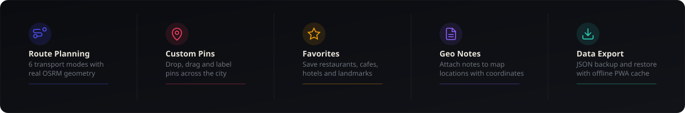
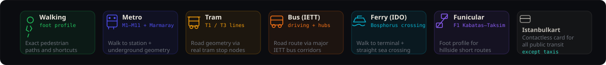
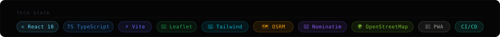
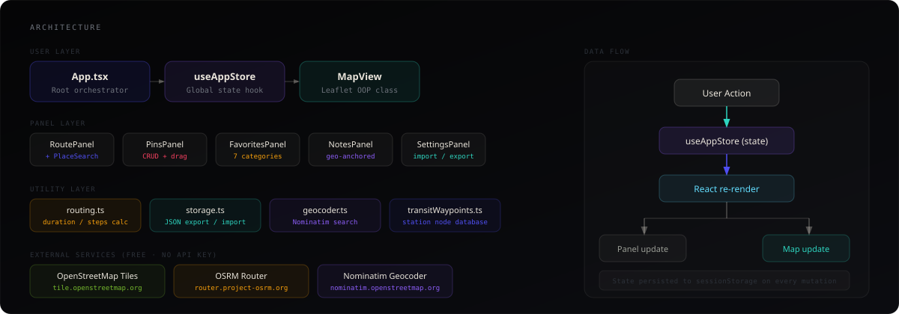
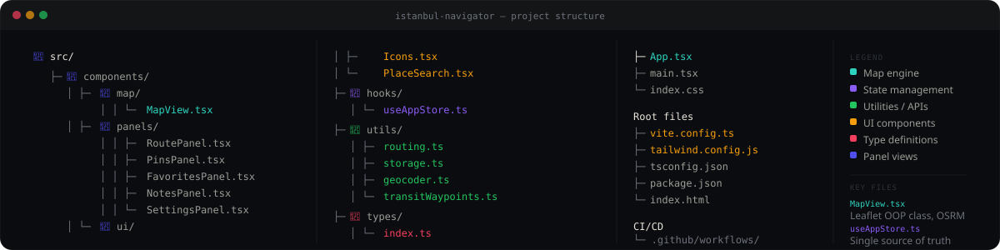
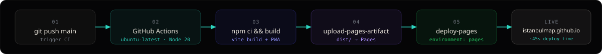

<div align="center">


<br/>

[](https://istanbulmap.github.io/)
[](https://github.com/istanbulmap/istanbulMap/actions)
[](https://www.typescriptlang.org/)
[](https://react.dev/)
[](https://vitejs.dev/)
[](#)
[](#license)

<br/>

> **Istanbul Navigator** is a production-ready offline-capable map application built for exploring Istanbul, Turkey. Plan routes across all public transport modes, drop custom pins, save favorite locations, write geo-anchored notes, and carry your entire travel profile as a portable JSON file.

<br/>

</div>

---

## Features



<br/>

### Route Planning

Six transport modes, each routed through real Istanbul infrastructure using the free OSRM public API and a curated database of station coordinates. Every mode draws a geometrically distinct path on the map.



| Mode | OSRM Profile | Path Strategy |
|------|-------------|---------------|
| **Walking** | `foot` | Direct A to B via pedestrian paths and footbridges |
| **Metro** | `foot` + straight segments | Walk to nearest station, underground geometry through real M1-M11 and Marmaray nodes, walk to exit |
| **Tram** | `driving` | Road geometry routed through actual T1 / T3 stop coordinates |
| **Bus** | `driving` | Road geometry via major IETT bus hub waypoints |
| **Ferry** | `foot` + straight crossing | Walk to nearest terminal (Eminonu, Kabatas, Kadikoy...), straight Bosphorus crossing, walk to destination |
| **Funicular** | `foot` | Short hillside foot route for F1 Kabatas to Taksim |

> All routing uses [OSRM](https://router.project-osrm.org) and [Nominatim](https://nominatim.openstreetmap.org) completely free, no API key required.

<br/>

### Place Search

The A and B route inputs use the Nominatim geocoder with Istanbul-biased results. Type any place name, landmark, neighbourhood or street and select from a dropdown of suggestions. Debounced at 420 ms to avoid flooding the API.

### Custom Pins

Double-click or right-click anywhere on the map to drop a pin. Drag any pin to reposition it. Each pin supports:
- Custom label and freeform note
- Six colour options
- Favorite flag with a star indicator on the map marker
- Editable inline without leaving the panel

### Favorites

Seven categories: Restaurant, Cafe, Hotel, Attraction, Shopping, Transport, Other. Ships with 24 curated Istanbul presets including top restaurants, cafes, hotels and all major landmarks. Add any location visible on the map by centering the viewport over it and using the "Save current map location" form.

### Geo-Anchored Notes

Write travel notes and optionally snap the current map center into the note as a coordinate anchor. Notes can be pinned to the top of the list and edited in place. Location badges render inline in teal showing the stored coordinates.

### Data Portability

All pins, favorites, notes and saved routes are serialised to a single JSON file on export. Import merges the file with the current session using a deduplication strategy keyed on `id`. No data ever leaves your device or touches a server.

---

## Tech Stack



<br/>

| Layer | Technology |
|-------|-----------|
| UI framework | React 18 with functional components and hooks |
| Language | TypeScript 5.4, strict mode |
| Build tool | Vite 5.3 with `@vitejs/plugin-react` |
| Map engine | Leaflet 1.9 via a custom OOP `MapView` class |
| Routing | OSRM public API (`foot` and `driving` profiles) |
| Geocoding | Nominatim OpenStreetMap (debounced, Istanbul-biased) |
| Transit data | Hand-curated Istanbul station waypoints (`transitWaypoints.ts`) |
| Styling | Tailwind CSS 3.4 with custom brand token palette |
| Fonts | Space Grotesk (sans), Fraunces (serif), JetBrains Mono |
| Offline | Vite PWA plugin with Workbox tile caching (30-day cache) |
| CI/CD | GitHub Actions with `upload-pages-artifact` and `deploy-pages` |
| Tile layer | OpenStreetMap with CSS dark filter (`invert + hue-rotate`) |

---

## Architecture



### State Management

A single `useAppStore` hook (React `useState` composition, no external library) acts as the source of truth for all application state. Every mutation is persisted to `sessionStorage` synchronously so the session survives page refreshes within the same tab.

```
User gesture
  → Leaflet event handler (reads from refs to avoid stale closures)
  → useAppStore setter
  → React re-render
  → Panel UI update + MapView.syncPins / drawRouteReal
```

### Stale Closure Strategy

All Leaflet event handlers registered at map init capture `useRef` values rather than closure variables. The refs are updated on every render, so the handlers always read current state without needing to be re-registered.

### Route Request Cancellation

Each call to `drawRouteReal` creates a new `AbortController` and cancels the previous one. This guarantees that switching transport modes rapidly never results in a stale OSRM response overwriting a newer one.

---

## Project Structure



```
istanbul-navigator/
├── src/
│   ├── App.tsx                        # Root layout and Leaflet init
│   ├── main.tsx                       # Entry point
│   ├── index.css                      # Global styles and Leaflet overrides
│   ├── components/
│   │   ├── map/
│   │   │   └── MapView.tsx            # Leaflet OOP class, routing, markers
│   │   ├── panels/
│   │   │   ├── RoutePanel.tsx         # Route planner with PlaceSearch inputs
│   │   │   ├── PinsPanel.tsx          # Pin CRUD, colour picker, drag
│   │   │   ├── FavoritesPanel.tsx     # 7-category favorites with custom add
│   │   │   ├── NotesPanel.tsx         # Geo-anchored notes
│   │   │   └── SettingsPanel.tsx      # Export / import / transit guide
│   │   └── ui/
│   │       ├── Icons.tsx              # 30+ hand-drawn SVG icon components
│   │       └── PlaceSearch.tsx        # Nominatim autocomplete input
│   ├── hooks/
│   │   └── useAppStore.ts             # Global state hook
│   ├── utils/
│   │   ├── routing.ts                 # Duration and step calculations
│   │   ├── storage.ts                 # JSON export / import / session persist
│   │   ├── geocoder.ts                # Nominatim fetch with throttling
│   │   └── transitWaypoints.ts        # Istanbul station node database
│   └── types/
│       └── index.ts                   # All TypeScript interfaces
├── public/
│   └── favicon.svg
├── .github/
│   └── workflows/
│       └── deploy.yml                 # Build and deploy to GitHub Pages
├── vite.config.ts                     # Vite + PWA configuration
├── tailwind.config.js                 # Brand token palette
├── tsconfig.json
├── package.json
└── index.html
```

---

## Getting Started

### Prerequisites

- Node.js 20 or later
- npm 10 or later

### Local Development

```bash
# Clone the repository
git clone https://github.com/istanbulmap/istanbulMap.git
cd istanbulMap

# Install dependencies
npm install

# Start the development server
npm run dev
```

The application will be available at `http://localhost:5173`.

### Production Build

```bash
npm run build
npm run preview
```

The built output lands in `dist/` and is fully self-contained.

---

## Deployment



Deployment is fully automated via GitHub Actions on every push to `main`.

### First-time Setup

1. Fork or push the repository to a GitHub account or organisation named `istanbulmap`
2. Navigate to **Settings > Pages** in the repository
3. Set **Source** to `GitHub Actions`
4. Push to `main`. The workflow handles the rest.

### Workflow Summary

```yaml
on:
  push:
    branches: [main]

jobs:
  build:   # npm ci, vite build, upload-pages-artifact
  deploy:  # deploy-pages to istanbulmap.github.io
```

Deploy time is typically under 45 seconds from push to live.

---

## Data Format

All user data is stored and transferred as a single JSON file. The schema is versioned and merge-safe.

```jsonc
{
  "version": "1.0.0",
  "exportedAt": "2026-10-03T12:00:00.000Z",
  "pins": [
    {
      "id": "uuid-v4",
      "position": { "lat": 41.0086, "lng": 28.9802 },
      "label": "Hagia Sophia",
      "note": "Visit at dawn before the crowds.",
      "color": "blue",
      "isFavorite": true,
      "createdAt": "ISO-8601",
      "updatedAt": "ISO-8601"
    }
  ],
  "savedRoutes": [
    {
      "id": "uuid-v4",
      "name": "Hotel to Grand Bazaar",
      "from": { "position": { "lat": 41.01, "lng": 28.97 }, "label": "Hotel" },
      "to":   { "position": { "lat": 41.01, "lng": 28.96 }, "label": "Grand Bazaar" },
      "mode": "walking",
      "createdAt": "ISO-8601"
    }
  ],
  "favoriteLocations": [ /* ... */ ],
  "notes": [
    {
      "id": "uuid-v4",
      "title": "Best simit spot",
      "content": "Cart by the Galata Bridge, north side.",
      "position": { "lat": 41.0208, "lng": 28.974 },
      "pinned": false,
      "createdAt": "ISO-8601",
      "updatedAt": "ISO-8601"
    }
  ]
}
```

Import merges incoming data with the current session by `id`, so re-importing an updated file adds new entries without duplicating existing ones.

---

## Istanbul Transit Reference

| Line | Type | Coverage |
|------|------|----------|
| M1 | Metro | Aksaray to Ataturk Airport |
| M2 | Metro | Yenıkapi to Haciosman |
| M3 | Metro | Kirazli to Olimpiyatkoy |
| M4 | Metro | Kadikoy to Sabiha Gokcen Airport |
| M5 | Metro | Uskudar to Cekmekoy |
| M7 | Metro | Mecidiyekoy to Mahmutbey |
| M9 | Metro | Atakoy to Ikitelli |
| M11 | Metro | Gayrettepe to Istanbul Airport |
| Marmaray | Rail | Undersea Bosphorus tunnel crossing |
| T1 | Tram | Kabatas to Bagcilar (Sultanahmet corridor) |
| T3 | Tram | Kadikoy to Moda (Asian side) |
| F1 | Funicular | Kabatas ferry terminal to Taksim Square |
| IDO / Sehir Hatlari | Ferry | Eminonu, Kabatas, Besiktas to Uskudar, Kadikoy |
| IETT | Bus | Extensive city-wide network |

**Istanbulkart** contactless card is accepted on all public transport and offers discounted fares versus single tickets.

---

## Browser Support

| Browser | Status |
|---------|--------|
| Chrome 120+ | Fully supported |
| Firefox 121+ | Fully supported |
| Safari 17+ (iOS + macOS) | Fully supported |
| Edge 120+ | Fully supported |
| Samsung Internet 23+ | Fully supported |

PWA offline caching is supported in all listed browsers. Service worker tile caching activates after first visit and provides 30 days of offline map access for cached zoom levels.

---

## Contributing

Pull requests are welcome. For significant changes, open an issue first to discuss the intended approach.

```bash
# Create a feature branch
git checkout -b feat/your-feature-name

# Make changes and commit
git commit -m "feat: description of change"

# Push and open a PR against main
git push origin feat/your-feature-name
```

Branch naming convention: `feat/`, `fix/`, `refactor/`, `docs/`, `chore/`.

---

## License

MIT License. See [LICENSE](LICENSE) for details.

Map data copyright [OpenStreetMap contributors](https://www.openstreetmap.org/copyright), available under the Open Database Licence. Routing provided by [OSRM](https://project-osrm.org/). Geocoding by [Nominatim](https://nominatim.org/).

---

<div align="center">

Built with the [Abyssal Liturgy](https://hassanireza.github.io/portfolio) design system.

<br/>

[](https://istanbulmap.github.io/)

</div>
